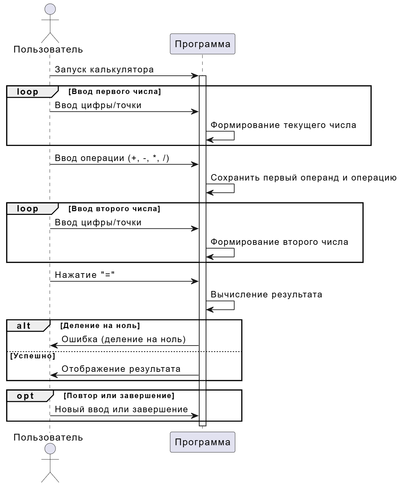
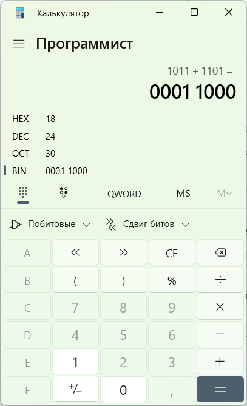
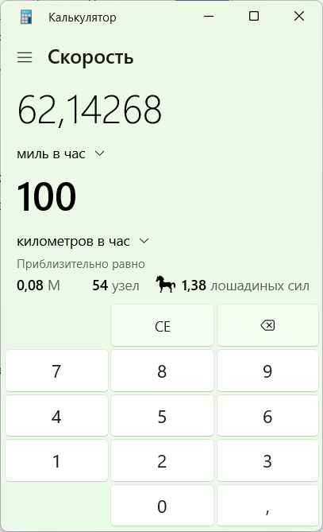
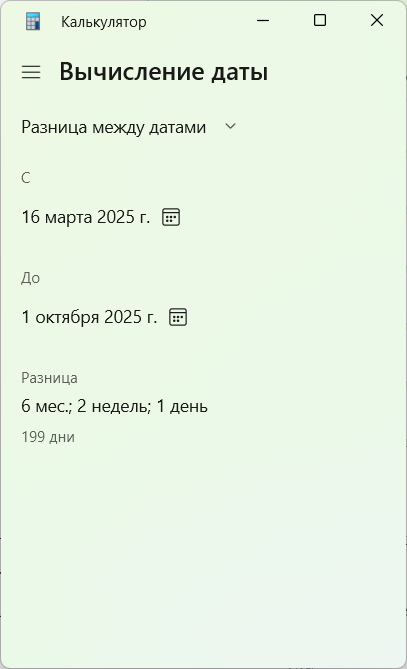

# НАИМЕНОВАНИЕ ОРГАНИЗАЦИИ

**ИНСТРУКЦИЯ ПОЛЬЗОВАТЕЛЯ**

программа «Калькулятор» в Windows

На 16 листах

2025

## Содержание

1. [ВВЕДЕНИЕ](#введение)  
2. [Термины, определения и сокращения](#термины-определения-и-сокращения)  
3. [Назначение и условия применения](#назначение-и-условия-применения)  
4. [Описание операций](#описание-операций)  
   4.1 [Запуск программы](#запуск-программы)  
   4.2 [Основные режимы работы](#основные-режимы-работы)  
   4.3 [Выбор режима](#выбор-режима)  
   4.4 [Выполнение расчетов](#выполнение-расчетов)  
   4.5 [Сложные примеры вычислений](#сложные-примеры-вычислений)  
   4.6 [Дополнительные функции](#дополнительные-функции)  
   4.7 [Закрытие программы и аварийные ситуации](#закрытие-программы-и-аварийные-ситуации)  

---

## ВВЕДЕНИЕ

Настоящая инструкция предназначена для пользователей программы «Калькулятор», входящей в состав операционной системы Windows. Документ поможет освоить основные и расширенные функции приложения, включая простые вычисления, инженерные расчеты, работу с системами счисления и конвертацию величин.

Инструкция также может использоваться как учебный материал для изучения технического письма и анализа интерфейсов программного обеспечения.

---

## Термины, определения и сокращения

Термины и определения приведены в таблице 1.

| Термин                | Определение                                                                 |
|------------------------|-----------------------------------------------------------------------------|
| Журнал вычислений      | История ранее выполненных расчетов                                          |
| Пользователь           | Лицо, использующее программу «Калькулятор»                                 |
| Программа              | Программа «Калькулятор», предназначенная для выполнения математических операций |
| Режим работы           | Вариант интерфейса (обычный, инженерный, программист и др.)                |

*Таблица 1 — Термины и определения*

---

## Назначение и условия применения

Программа «Калькулятор» предназначена для выполнения математических вычислений, включая простые арифметические операции, инженерные и научные расчеты, а также конвертацию величин.

**Условия применения:**  
- Операционная система Windows 7 и выше.  
- Наличие клавиатуры или сенсорного ввода.  

Процесс выполнения вычислений в программе «Калькулятор» представлен на диаграмме последовательности (см. рисунок 1), которая демонстрирует взаимодействие между пользователем и программой. Диаграмма подробно показывает шаги, начиная от запуска программы и заканчивая получением результата или обработкой ошибок (например, деления на ноль). Особое внимание уделено циклическому вводу чисел и опциональным действиям после завершения вычислений, таких как повторный ввод или завершение работы.

*Рисунок 1 — Процесс выполнения вычислений в программе «Калькулятор»*

---

## Описание операций

### 4.1 Запуск программы

Для запуска программы выполните следующие действия (см. рисунок 2):  
1. Нажмите кнопку «Пуск» в левом нижнем углу экрана.  
2. В списке программ выберите «Калькулятор» (или введите название в поисковую строку).  
3. Нажмите по значку программы для открытия.  

---

### 4.2 Основные режимы работы

Программа поддерживает несколько режимов:  
1. **Обычный** — базовые арифметические операции (сложение, вычитание, умножение, деление).  
2. **Инженерный** — расширенные функции (тригонометрия, логарифмы, степени).  
3. **Программист** — вычисления в различных системах счисления (двоичной, восьмеричной, шестнадцатеричной).  
4. **Вычисление даты** — разница между датами.  
5. **Конвертер величин** — перевод единиц длины, веса, температуры и др.  

---

### 4.3 Выбор режима

Для выбора режима (см. рисунок 3):  
1. Откройте меню «≡» (в верхнем левом углу).  
2. Выберите нужный режим.  

---

### 4.4 Выполнение расчетов

Для выполнения расчетов:  
1. Вводите числа и операции с помощью кнопок на экране или клавиатуры (см. рисунок 4).  
2. Для выполнения вычисления нажмите «=» (равно).  
3. Для сброса — кнопку «C» (очистить).  

---

### 4.5 Сложные примеры вычислений

#### Пример 1: Вычисление с использованием скобок и приоритета операций (режим «Инженерный»)  
**Задача:**  
Вычислить выражение:  
(5 + 3) × (7 − 2)²  

**Шаги:**  
1. Переключитесь в режим «Инженерный» через меню «≡».  
2. Введите:  
   (5 + 3) × (7 − 2) x²  
3. Нажмите «=».  

**Результат:** 200  

**Обоснование:**  
(5 + 3) = 8  
(7 − 2) = 5, 5² = 25  
8 × 25 = 200  

#### Пример 2: Тригонометрическое вычисление (режим «Инженерный»)  
**Задача:**  
Найти значение sin(30°).  

**Шаги:**  
1. Убедитесь, что выбрана единица измерения «Градусы».  
2. Введите: 30.  
3. Нажмите «sin».  

**Результат:** 0.5  

**Обоснование:**  
sin(30°) = 0.5  

#### Пример 3: Работа с системами счисления (режим «Программист»)  
**Задача:**  
Сложить два числа в двоичной системе: 1011₂ + 1101₂.  

**Шаги:**  
1. Переключитесь в режим «Программист».  
2. Установите переключатель на «Bin» (двоичная система).  
3. Введите: 1011.  
4. Нажмите «+».  
5. Введите: 1101.  
6. Нажмите «=».  

**Результат:** 11000  

**Проверка в десятичной системе:**  
1011₂ = 11₁₀  
1101₂ = 13₁₀  
11 + 13 = 24₁₀  
24₁₀ = 11000₂  

#### Пример 4: Конвертация единиц измерения (режим «Конвертер величин»)  
**Задача:**  
Перевести 100 км/ч в мили в час.  

**Шаги:**  
1. Переключитесь в режим «Конвертер величин».  
2. Выберите категорию: «Скорость».  
3. В поле слева выберите «Километры в час».  
4. В поле справа выберите «Мили в час».  
5. Введите значение: 100.  

**Результат:** 62.1371 миль/ч  

**Обоснование:**  
1 км/ч ≈ 0.621371 миль/ч → 100 × 0.621371 = 62.1371  

#### Пример 5: Расчет разницы между датами  
**Задача:**  
Найти количество дней между 16 марта 2025 и 1 октября 2025.  

**Шаги:**  
1. Переключитесь в режим «Вычисление даты».  
2. Выберите тип расчета: «Разница между датами».  
3. Установите:  
   - Начальная дата: 16.03.2025  
   - Конечная дата: 01.10.2025  
4. Нажмите «Вычислить».  

**Результат:** 199 дней  

**Проверка:**  
Март: 16 дней (с 16 по 31)  
Апрель: 30  
Май: 31  
Июнь: 30  
Июль: 31  
Август: 31  
Сентябрь: 30  
Октябрь: 1  
**Итого:** 16+30+31+30+31+31+30+1 = 199 дней  

---

### 4.6 Дополнительные функции

- **Копирование результата:** нажмите «Ctrl + C» или кнопку «Копировать» в меню.  
- **Вставка числа:** используйте «Ctrl + V» или кнопку «Вставить».  
- **История вычислений:** доступна в меню «≡» → «Журнал» (см. рисунок 10).  

---

### 4.7 Закрытие программы и аварийные ситуации

**Для завершения работы:**  
1. Нажмите «✕» в правом верхнем углу окна (см. рисунок 11).  
2. Или используйте сочетание клавиш «Alt + F4».  

**При аварийных ситуациях:**  
1. Если программа не отвечает, закройте через «Диспетчер задач» (Ctrl + Shift + Esc).  
2. При ошибке ввода очистите поле кнопкой «C».  

