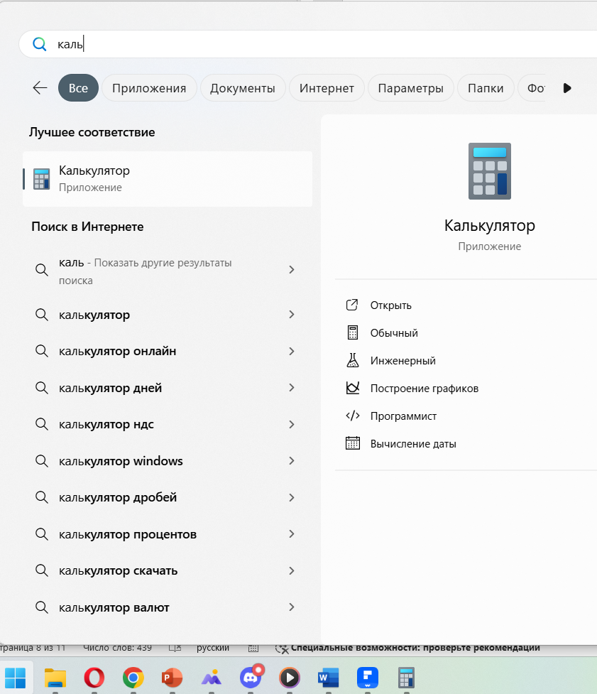
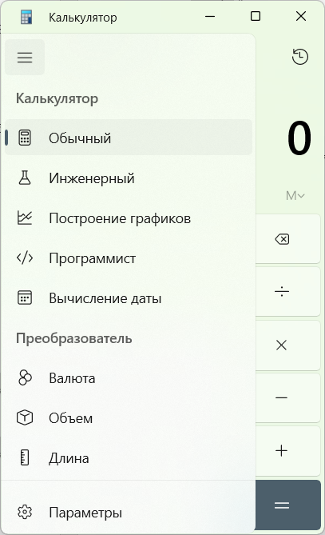
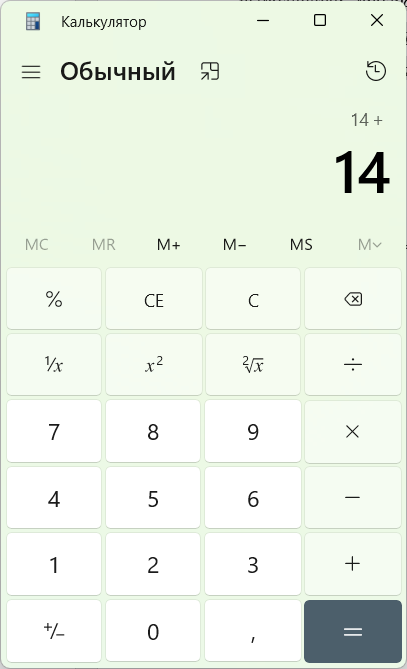
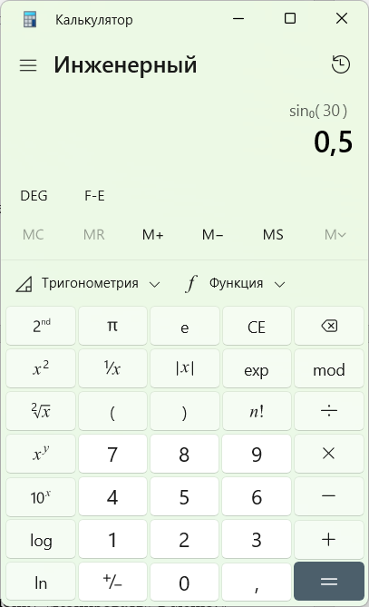
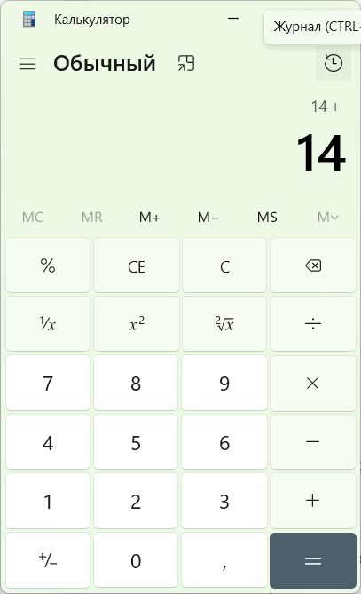
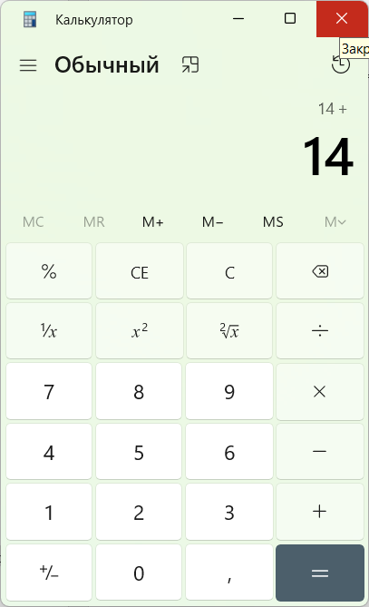

# ИНСТРУКЦИЯ ПОЛЬЗОВАТЕЛЯ  
## программа «Калькулятор» в Windows  

*На 16 листах*  
*2025*  

---

## Содержание  
1. [Введение](#введение)  
2. [Термины, определения и сокращения](#термины-определения-и-сокращения)  
3. [Назначение и условия применения](#назначение-и-условия-применения)  
4. [Описание операций](#описание-операций)  
   4.1. [Запуск программы](#запуск-программы)  
   4.2. [Основные режимы работы](#основные-режимы-работы)  
   4.3. [Выбор режима](#выбор-режима)  
   4.4. [Выполнение расчетов](#выполнение-расчетов)  
   4.5. [Сложные примеры вычислений](#сложные-примеры-вычислений)  
   4.6. [Дополнительные функции](#дополнительные-функции)  
   4.7. [Закрытие программы и аварийные ситуации](#закрытие-программы-и-аварийные-ситуации)  

---

## Введение  
Настоящая инструкция предназначена для пользователей программы «Калькулятор», входящей в состав операционной системы Windows. Документ поможет освоить основные и расширенные функции приложения, включая простые вычисления, инженерные расчеты, работу с системами счисления и конвертацию величин.  

Инструкция также может использоваться как учебный материал для изучения технического письма и анализа интерфейсов программного обеспечения.  

---

## Термины, определения и сокращения  

| Термин               | Определение                                                                 |
|----------------------|-----------------------------------------------------------------------------|
| Журнал вычислений    | История ранее выполненных расчетов                                          |
| Пользователь         | Лицо, использующее программу «Калькулятор»                                 |
| Программа            | Программа «Калькулятор», предназначенная для выполнения математических операций |
| Режим работы         | Вариант интерфейса (обычный, инженерный, программист и др.)                |

---

## Назначение и условия применения  
Программа «Калькулятор» предназначена для:  
- выполнения математических вычислений;  
- инженерных и научных расчетов;  
- конвертации величин.  

**Условия применения:**  
- Операционная система Windows 7 и выше;  
- Наличие клавиатуры или сенсорного ввода.  

  

---

## Описание операций  

### 4.1 Запуск программы  
1. Нажмите кнопку **«Пуск»** в левом нижнем углу экрана.  
2. В списке программ выберите **«Калькулятор»** (или введите название в поисковую строку).  
3. Нажмите по значку программы для открытия.  

  

### 4.2 Основные режимы работы  
1. **Обычный** — базовые арифметические операции (+, -, ×, ÷).  
2. **Инженерный** — тригонометрия, логарифмы, степени.  
3. **Программист** — вычисления в системах счисления (двоичная, восьмеричная и др.).  
4. **Вычисление даты** — разница между датами.  
5. **Конвертер величин** — перевод единиц измерения.  

### 4.3 Выбор режима  
1. Откройте меню **«≡»** (в верхнем левом углу).  
2. Выберите нужный режим.  

  

### 4.4 Выполнение расчетов  
1. Вводите числа и операции с помощью кнопок на экране или клавиатуры.  
2. Для выполнения вычисления нажмите **«=»**.  
3. Для сброса — кнопку **«C»**.  

  

### 4.5 Сложные примеры вычислений  

**Пример 1: Приоритет операций (Инженерный режим)**  
Вычислить:  
$$(5 + 3) × (7 − 2)^2$$  
1. Введите:  
   ```(5 + 3) × (7 − 2) x²```  
2. Нажмите **«=»**.  
**Результат:** 200.  

  

**Пример 2: Тригонометрия (Инженерный режим)**  
Найти:  
$$\sin(30°)$$  
1. Убедитесь, что выбраны **«Градусы»**.  
2. Введите:  
   ```30 sin```  
**Результат:** 0.5.  

  

### 4.6 Дополнительные функции  
- **Копирование результата:** `Ctrl + C` или кнопка **«Копировать»**.  
- **Вставка числа:** `Ctrl + V` или кнопка **«Вставить»**.  
- **Журнал вычислений:** Меню **«≡»** → **«Журнал»**.  

  

### 4.7 Закрытие программы и аварийные ситуации  
- **Закрытие:** Нажмите **«✕»** или используйте `Alt + F4`.  
- **Аварийные ситуации:**  
  - Если программа не отвечает, закройте ее через **«Диспетчер задач»** (`Ctrl + Shift + Esc`).  
  - При ошибке ввода нажмите **«C»** для сброса.  

  
